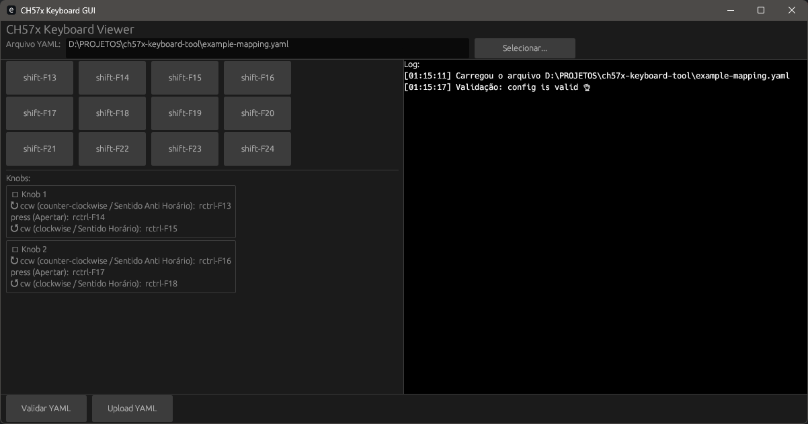
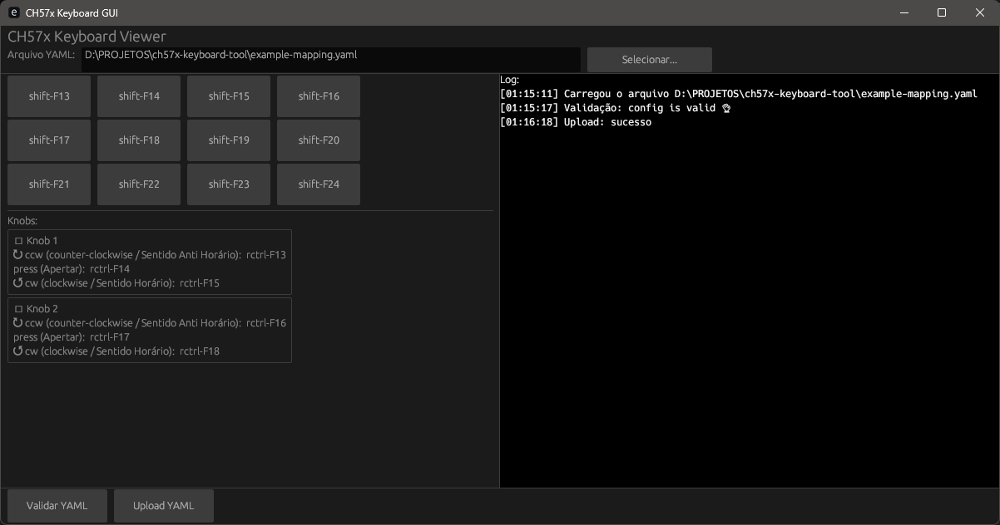
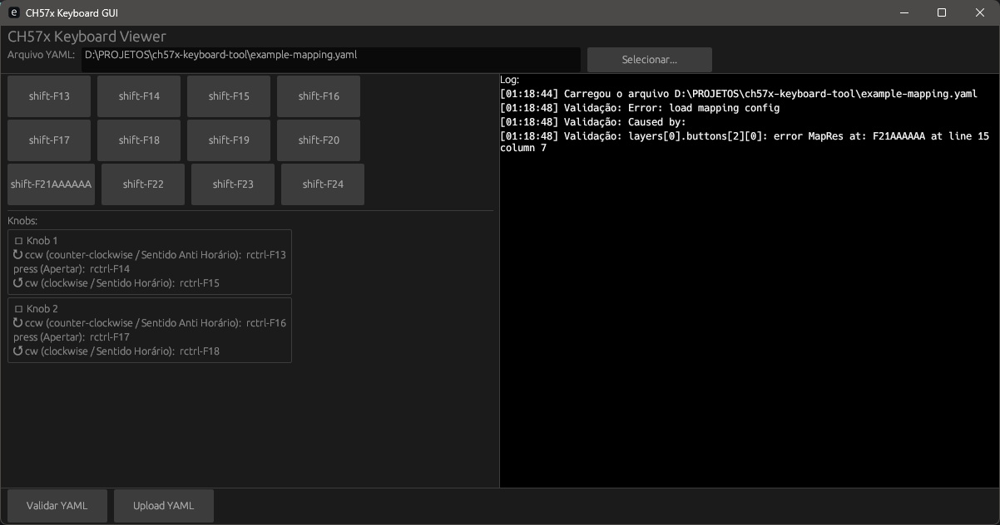
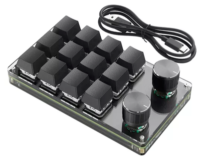

# CH57x Keyboard GUI

 


Este projeto é uma interface gráfica (GUI) complementar para o repositório original [kriomant/ch57x-keyboard-tool](https://github.com/kriomant/ch57x-keyboard-tool).

> ⚠️ Este projeto **não substitui** o `cli`, apenas estende seu uso via uma interface amigável.

## Objetivo
Permitir que usuários configurem teclados baseados no CH57x por meio de uma interface gráfica moderna em vez da linha de comando.

## Funcionalidades
- Visualização do teclado mapeado via arquivo YAML
- Edição não disponível nesta versão (read-only)
- Validação de YAML via binário `ch57x-keyboard-tool`
- Upload do YAML via `ch57x-keyboard-tool`
- Log estruturado com horário

## Motivação
Eu estava me aventurando em **Rust**, uma linguagem que ainda não conheço bem, mas decidi me desafiar e criar essa GUI a partir do zero. Estou aprendendo enquanto construo!

Tenho um teclado CH57x com 3 linhas, 4 colunas e 2 knobs e, embora o repositório original tenha uma interface de linha de comando, eu queria algo mais visual. A ideia inicial era criar uma GUI simples, mas acabei me empolgando e adicionando mais recursos.

Abaixo uma imagem da interface atual:


A interface é simples, mas funcional. Ela permite que você visualize o mapeamento do teclado e valide o arquivo YAML. O upload do arquivo também é suportado, embora a edição ainda não esteja disponível.


A interface também exibe mensagens de sucesso ou erro após a validação e o upload do arquivo YAML. Isso facilita a identificação de problemas e garante que o mapeamento do teclado esteja correto antes de ser enviado para o dispositivo.


A interface exibe mensagens de erro quando o arquivo YAML não é válido. Isso ajuda a identificar rapidamente problemas de formatação ou configuração antes de tentar fazer o upload para o teclado.

## Estrutura do Projeto

```text
ch57x-keyboard-tool/
├── .gitignore
├── Cargo.lock
├── Cargo.toml
├── example-mapping.yaml
├── example-mapping-original.yaml
├── cli/
│   ├── Cargo.toml
│   └── src/
│       ├── config.rs
│       ├── consts.rs
│       ├── main.rs
│       ├── options.rs
│       ├── parse.rs
│       └── keyboard/
└── gui/
    ├── Cargo.toml
    └── src/
        └── main.rs
```

⚠️ O arquivo `example-mapping-original.yaml` é o arquivo original que do repositório do cli, então tem todas as instruções e informações importantes para a configuração do arquivo yaml.

⚠️ Já o arquivo `example-mapping.yaml` é o arquivo que eu uso pessoalmente. Ele tem o mapeamento do meu teclado, que é um teclado mecânico com 3 linhas, 4 colunas e 2 knobs. O arquivo é um exemplo de como o mapeamento pode ser configurado para um teclado específico.



Teclado que utilizo para testar o projeto. Ele é um teclado mecânico com 3 linhas, 4 colunas e 2 knobs. O arquivo `example-mapping.yaml` contém o mapeamento específico para este teclado.

## Build

Para compilar a GUI manualmente:
```bash
cd gui
cargo build --release
```

## Release Automática
O repositório utiliza GitHub Actions para compilar e gerar versões automaticamente ao criar tags do tipo `v*.*.*`. Veja `.github/workflows/release.yml` para detalhes.

## Contribuição
Contribuições são bem-vindas! Se você deseja contribuir com o projeto, siga estas etapas:
1. Faça um fork do repositório.
2. Crie uma nova branch para sua feature ou correção de bug.
3. Faça suas alterações e commit.
4. Envie um pull request para o repositório original.
5. Aguarde a revisão e feedback.
6. Aguarde a aprovação e mesclagem do seu pull request.
7. Agradeça a todos os envolvidos e continue contribuindo para o projeto!

## Licença
Este projeto é licenciado sob a Licença MIT. Veja o arquivo [LICENSE](LICENSE) para mais detalhes.

## Agradecimentos

Agradeço ao desenvolvedor inicial ([Kriomant](https://github.com/kriomant)) do projeto ch57x-keyboard-tool, que me inspirou a criar esta GUI. O trabalho dele foi fundamental para o desenvolvimento deste projeto e eu sou grato por sua contribuição à comunidade.